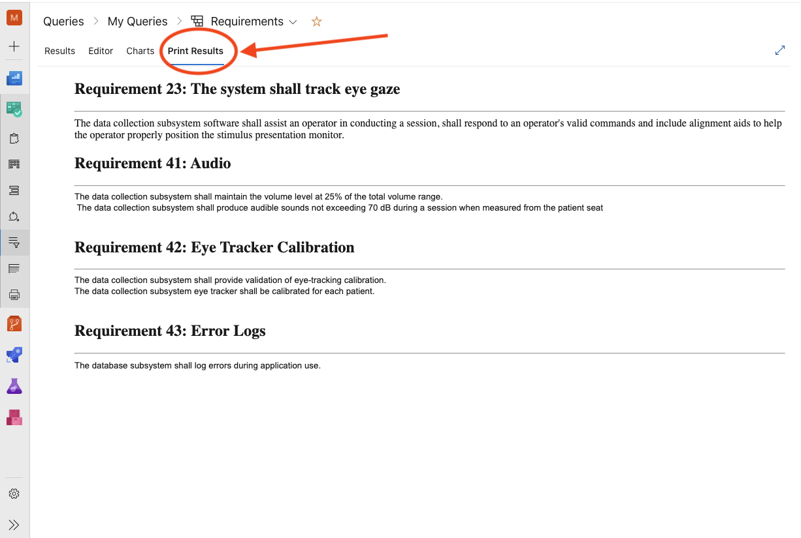

This extension adds a "Print Results" panel to the Query Results page that nicely displays the results of the query:



## Debugging
In order to debug you have to run a local web server with https using the following command:
`npm run dev` -- --https
To create a SSL certificate for localhost run the following commands:
```
openssl req -x509 -newkey rsa:2048 -keyout keytmp.pem -out cert.pem -days 365
openssl rsa -in keytmp.pem -out key.pem       
```

If when you first try to load the extension in azure devOPs you dont see the extension go the following url in the browser: https://localhost:3000/panel.html. Many browsers will not let the page load because the ssl certificate is for localhost. If this happens look up that particular browser's steps to allow https over localhost. 
 
## Create a Production Package
Run the following command to create a dev package:
`npm run build-package-production`

This will generate a vsix file with the following format: __JasonDavis.work-item-document-generator-`<VersionNumber>`.vsix__

## Create a DEV Package
Run the following command to create a dev package:
`npm run build-package-dev`

This will generate a vsix file with the following format: __JasonDavis.work-item-document-generator-dev-`<VersionNumber>`.vsix__

## Scopes
Needed in order to make the api request
https://docs.microsoft.com/en-us/azure/devops/extend/develop/manifest?view=azure-devops#scopes
